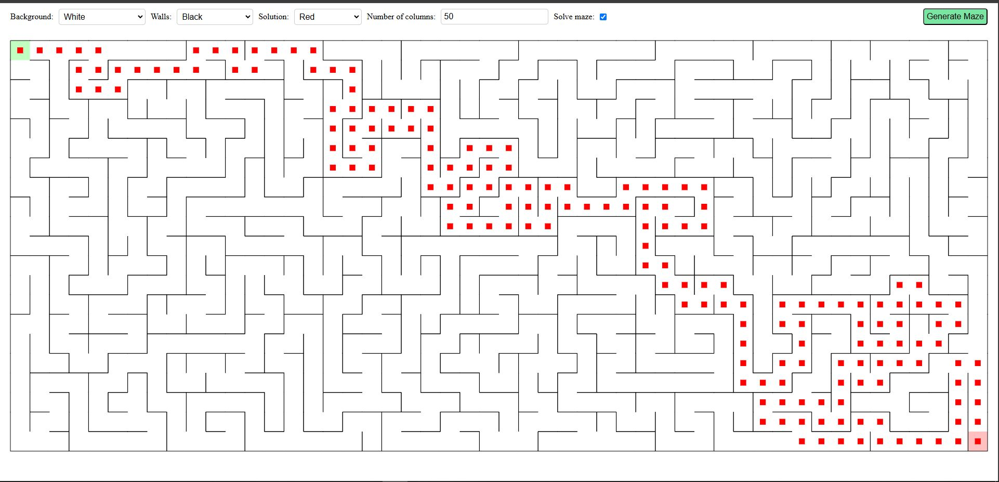
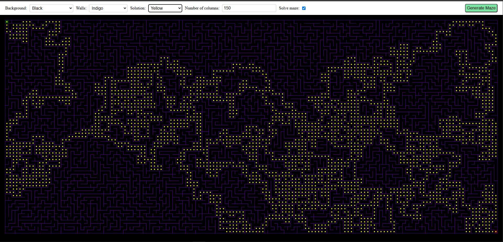

# Maze Generator

---

### Description

This project is a web-based application for generating and solving mazes, built using JavaScript. Users can customize the maze by selecting the number of rows, adjusting colors for the background, walls, and solution path, and enabling/disabling the option to visualize the solution. The application demonstrates fundamental concepts in algorithm implementation, interactivity, and dynamic styling.

### Screenshots

  
  &nbsp; &nbsp; &nbsp; &nbsp;
  

(_full size images can be found [here](./screenshots)_)

### Functionality

- Generate mazes.
- Select the number of rows in the maze (between 10 and 300).
- Select different colours (for the background, walls, and solution).
- Check/un-check the option to solve the maze and display the solution.

### What was learnt

While working on this project, I gained experience in:

- Algorithm Implementation: Implementing well-known algorithms such as depth-first search for maze generation and bredth-first search (A\*) for solving the maze.
- JavaScript Skills: Enhancing my knowledge of JavaScript, including ES6+ syntax, modular design, and DOM manipulation.
- Dynamic Styling: Using JavaScript to dynamically change styles such as colors, enabling user customization.
- UI/UX: Designing an interactive and user-friendly interface that adjusts to different user inputs.

### Requirements

- A modern web browser
- A simple HTTP server, such as the Live Server extension for VS Code
- git

### How to use

To use the application, you can either go [here](https://luke663.github.io/maze-generator/) to see the app. hosted via GitHub pages or host it locally by completing the following steps:

- Clone the application:
  - Open a command terminal
  - Go to the directory on your computer where you wish to put the repository.
  - Run the commands:
    - git clone https\://github\.com/Luke663/maze-generator
- Run the application:
  - Open the folder (selected above) in VS Code.
  - Start your server (if using the VS Code live server extension click 'Go Live').

### License

This is a demonstration project and not intended for collaboration, as such a license has not been added meaning the default copyright laws apply and no one may reproduce, distribute, or create derivative works from this work.
